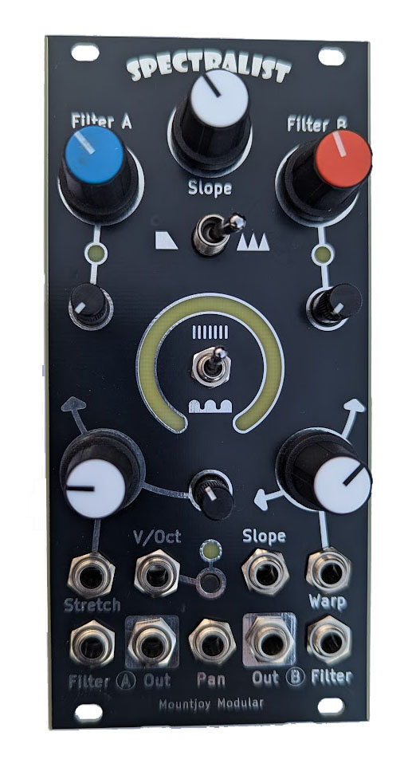
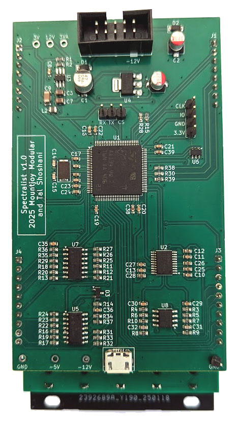

# Spectralist

## Overview

Spectralist is an additive oscillator for Eurorack modular synthesisers. Up to 300 harmonics are output over two separate Odd and Even channels with a 'filter' offering a range of options for sculpting the harmonic spectrum of the output signals.

There are two harmonic modes - individual harmonics and sinusoidal waves of harmonics. In individual harmonic mode the spread controls adjust the spacing of the harmonics and the warp control either progressively bunches up or spreads out the harmonics. In the sinusoidal mode the spread controls increase the frequency of the 'waves' of harmonics.

The filter can be selected as a low pass filter with continuously adjustable slope or as a comb filter with adjustable tooth width and spread. In the comb filter mode the channel filter controls set the width between teeth and the slope sets the rise and fall times of the teeth. The individual channel filters controls can be adjusted with potentiometers or by CV with with trimmers to attenuate.

The pan CV input allows each channel to be smoothly panned between the two outputs. This can be used to mix the signals together in a mono setup, or used to dynamically shift the harmonics in the stereo field.

In the centre of the module is a ring of LEDs that give a visual representation of the harmonic spread and warp settings.

The module was designed in conjunction with musician Tal Shoshani who produced the following demonstration video:

## Technical

The module is based around an STM32H723VGT microcontroller, clocked at 400MHz. A TI PCM5100APW 32 bit audio DAC is used for the two channel outputs.

A TL072 dual op-amps is used to amplify and filter the DAC output (and/or phase invert) the outputs from 3V to 9V peak-to-peak at maximum. Input CV signals are conditioned by MCP6004 op-amps.

A USB B micro port is available at the rear of the unit for software updgrades and configuration via a serial connection.

The animated 25 LED display is driven over I2C by a PCA9956B LED Driver and the SMD LEDs sit on a daughter board raising them to the level of the front panel.

[Components schematic](Hardware/Spectralist_Components.pdf)

[LED daughterboard schematic](Hardware/Spectralist_LED_Daughterboard.pdf)

[Controls schematic](Hardware/Spectralist_Controls.pdf)

## Power

Analog power is supplied via a 3.3V LDO regulator and digital power uses a TPS561201 switching power supply.

- +12V current draw: 139 mA
- -12V Current draw: 7 mA

## Errata

Panel Errata: Mode switch hole too large for subminiature switch
Filter type switch hole just too narrow
Harm_Warp_pot and Harm_Stretch_Pot wrong way round (fixed 1.1)

